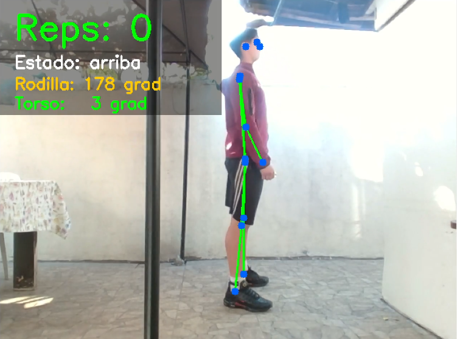
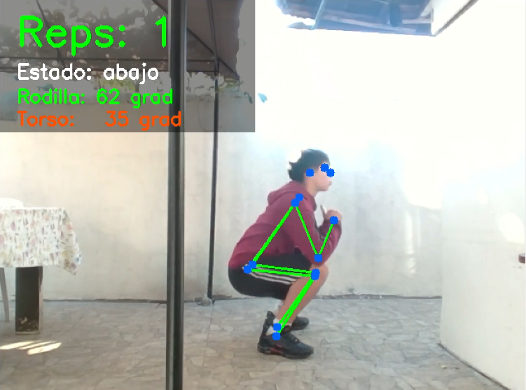

# CoachSentadilla — IA que cuenta y corrige tu sentadilla en tiempo real

> Proyecto didáctico para el canal **[PipetoLab](https://www.youtube.com/@PipetoLab)** sobre visión computacional aplicada al fitness.

---

## Demo

| Posición inicial | Posición en profundidad |
|:---:|:---:|
|  |  |
| Rodilla: 178° — Estado: up | Rodilla: 92° — Estado: down → Rep contada |

El sistema detecta el esqueleto en tiempo real, calcula el ángulo de rodilla y torso, y cuenta cada repetición en voz alta con una voz natural en español.

---

## ¿Qué hace?

- Cuenta las repeticiones **en voz alta** (1, 2, 3…) con voz Microsoft Neural (ElviraNeural).
- Avisa si **no bajas suficiente** al terminar el descenso.
- Mide el **ángulo de torso** para detectar inclinación excesiva hacia adelante.
- Dibuja el **esqueleto** sobre el video en tiempo real.
- Corre **100% local** — sin internet, sin APIs de pago (la voz se genera una sola vez al inicio).

---

## Conceptos de visión computacional que cubre

| Concepto | Dónde se aplica |
|---|---|
| Detección de objetos | YOLOv8 localiza a la persona en cada frame |
| Pose Estimation | 17 keypoints del cuerpo en formato COCO |
| Geometría computacional | Ángulo entre articulaciones con producto punto |
| Máquina de estados | Lógica `up → squatting → down` para contar reps |
| Inferencia en GPU | CUDA via PyTorch — inferencia a 60+ FPS |
| Síntesis de voz neuronal | Microsoft Edge TTS, pre-generado en MP3 local |

---

## Stack tecnológico

| Librería | Rol | Docs |
|---|---|---|
| Ultralytics YOLOv8 | Modelo de pose estimation | [docs.ultralytics.com](https://docs.ultralytics.com/tasks/pose/) |
| PyTorch + CUDA | Backend GPU | [pytorch.org](https://pytorch.org/get-started/locally/) |
| OpenCV | Captura de cámara y visualización | [docs.opencv.org](https://docs.opencv.org/4.x/) |
| edge-tts | Síntesis de voz Microsoft Neural | [github/rany2/edge-tts](https://github.com/rany2/edge-tts) |
| pygame | Reproducción de audio MP3 | [pygame.org](https://www.pygame.org/docs/) |
| NumPy | Cálculo de ángulos con álgebra lineal | [numpy.org](https://numpy.org/doc/) |

---

## Requisitos de hardware

| Componente | Mínimo | Recomendado |
|---|---|---|
| CPU | Intel i5 / Ryzen 5 | i7 13th gen o superior |
| GPU | Cualquier NVIDIA ≥ 4 GB VRAM | RTX 3060 / RTX 4060+ |
| RAM | 8 GB | 16 GB |
| Cámara | 720p, vista lateral | 1080p |

> Sin GPU NVIDIA el programa corre en CPU (~10–15 FPS). Sigue funcionando, solo con menos fluidez.

---

## Setup paso a paso

### 1. Prerrequisitos

**Python 3.10 o 3.11** (recomendado 3.11).

- Linux: `python3 --version`
- Windows: [python.org/downloads](https://www.python.org/downloads/) — marcar **"Add to PATH"** al instalar.

**Git:**
- Linux: `sudo apt install git`
- Windows: [git-scm.com](https://git-scm.com/)

### 2. Clonar el repositorio

```bash
git clone https://github.com/PipetoBlack/coachSentadilla.git
cd coachSentadilla
```

### 3. Crear y activar entorno virtual

Un entorno virtual aísla las dependencias del proyecto.

**Linux:**
```bash
python3 -m venv .venv
source .venv/bin/activate
```

**Windows (PowerShell):**
```powershell
python -m venv .venv
.venv\Scripts\Activate.ps1
```

El prompt cambia a `(.venv)` cuando está activo.

### 4. Instalar PyTorch con CUDA

Primero verifica tu versión de CUDA:
```bash
nvidia-smi   # busca "CUDA Version: XX.X"
```

**CUDA 12.1 (drivers recientes):**
```bash
pip install torch torchvision --index-url https://download.pytorch.org/whl/cu121
```

**CUDA 11.8:**
```bash
pip install torch torchvision --index-url https://download.pytorch.org/whl/cu118
```

**Solo CPU:**
```bash
pip install torch torchvision
```

Verificar que funciona:
```bash
python -c "import torch; print(torch.cuda.is_available(), torch.cuda.get_device_name(0))"
# True   NVIDIA GeForce RTX 4060
```

### 5. Instalar dependencias

```bash
pip install -r requirements.txt
```

Esto instala: `ultralytics`, `opencv-python`, `edge-tts`, `pygame`, `numpy`.

### 6. Correr

```bash
python main.py
```

La **primera vez** suceden dos cosas automáticamente:
1. YOLOv8 descarga el modelo `yolov8m-pose.pt` (~52 MB).
2. `edge-tts` genera los archivos de voz y los guarda en `.voice_cache/` (~30 archivos MP3).

A partir de la segunda ejecución arranca inmediato.

Presiona **`Q`** para salir.

> La cámara se configura en `CAMERA_INDEX` dentro de `main.py`. `0` = integrada, `1` = externa.

---

## Estructura del proyecto

```
coachSentadilla/
├── main.py              # Loop principal — orquesta todo
├── pose_detector.py     # Detección de pose con YOLOv8
├── squat_analyzer.py    # Máquina de estados + cálculo de ángulos
├── voice_coach.py       # Voz Microsoft Neural vía edge-tts
├── requirements.txt     # Dependencias del proyecto
├── inicio.png           # Captura — posición inicial
├── fin.png              # Captura — posición en profundidad
└── .voice_cache/        # MP3 pre-generados (se crea al primer run)
```

---

## ¿Qué hace cada archivo?

### `pose_detector.py`

Carga YOLOv8 y lo ejecuta sobre cada frame. Devuelve un diccionario con los 17 keypoints COCO, cada uno con `(x, y, confianza)`:

```
Keypoints usados:
  5, 6  → hombros
 11, 12 → caderas
 13, 14 → rodillas
 15, 16 → tobillos
```

Si hay varias personas en cámara, selecciona la de mayor confianza de detección.

### `squat_analyzer.py`

Recibe los keypoints y aplica geometría:

**Ángulo de rodilla** — producto punto entre los vectores `cadera→rodilla` y `tobillo→rodilla`:

```
angle = arccos( (BA · BC) / (|BA| · |BC|) )
```

Se promedian la pierna izquierda y derecha para mayor robustez.

**Máquina de estados:**

```
angle > 160°        angle < 95°
  [UP] ──────────► [SQUATTING] ──────────► [DOWN] → rep++
   ▲                                           │
   └───────────────────────────────────────────┘
              angle > 160°

"baja_mas" → solo si vuelve a UP sin haber pasado por DOWN
```

**Ángulo de torso** — inclinación del tronco respecto a la vertical usando `arctan2`.

### `voice_coach.py`

Usa **Microsoft Edge TTS** (`ElviraNeural`, español femenino) para generar los audios la primera vez, y **pygame** para reproducirlos sin latencia. Un flag `self.playing` evita superposición de mensajes.

Frases:
- Números del 1 al 20 (conteo de reps)
- `"Baja un poco más"` — si abortó la bajada sin llegar a profundidad
- `"Mantén la espalda más recta"` — si el torso supera 45° de inclinación

### `main.py`

Loop de captura → detección → análisis → voz → UI:

```python
while cap.isOpened():
    frame   = cap.read()          # captura
    lm      = detector.detect()   # YOLOv8 → keypoints
    result  = analyzer.analyze()  # ángulos + estado + feedback
    coach.say(result["feedback"]) # voz si hay feedback nuevo
    draw_ui(frame, result)        # overlay en pantalla
```

La UI colorea las métricas: **verde** = bien, **amarillo/rojo** = corrección necesaria.

---

## Personalización

**Cambiar cámara** — en `main.py`:
```python
CAMERA_INDEX = 0   # integrada
CAMERA_INDEX = 1   # externa (default)
```

**Cambiar modelo YOLO** — en `main.py`:
```python
PoseDetector(model='yolov8n-pose.pt')  # nano  — más rápido
PoseDetector(model='yolov8m-pose.pt')  # medium — balance (default)
PoseDetector(model='yolov8l-pose.pt')  # large  — más preciso
```

**Ajustar profundidad requerida** — en `squat_analyzer.py`:
```python
DOWN_ANGLE = 95   # default — paralelo al suelo
DOWN_ANGLE = 85   # más exigente
```

**Agregar frases** — en `voice_coach.py`:
```python
"fatiga": "Estás llegando al límite, aguanta.",
```
Luego retornar `feedback = "fatiga"` en el analyzer cuando corresponda.

**Cambiar voz** — en `voice_coach.py`:
```python
VOICE = "es-ES-ElviraNeural"   # España femenina (default)
VOICE = "es-MX-DaliaNeural"    # México femenina
VOICE = "es-AR-TomasNeural"    # Argentina masculina
```
Después de cambiar la voz, elimina la carpeta `.voice_cache/` para regenerar los audios.

---

## Roadmap

- [ ] Corrección de rodilla valgo/varo (rodilla que cae hacia adentro)
- [ ] Resumen de sesión al finalizar (reps, ángulo promedio, mejor rep)
- [ ] Soporte para sentadilla con barra
- [ ] Exportar sesión a CSV para seguimiento de progreso

---

## Referencias y recursos

### Modelos y frameworks
- [Ultralytics YOLOv8 — Pose Estimation](https://docs.ultralytics.com/tasks/pose/) — documentación oficial del modelo usado
- [COCO Dataset — Keypoint format](https://cocodataset.org/#keypoints-2020) — definición de los 17 keypoints del cuerpo
- [PyTorch — Get Started with CUDA](https://pytorch.org/get-started/locally/) — instalación correcta con soporte GPU

### Visión computacional
- [OpenCV — VideoCapture](https://docs.opencv.org/4.x/d8/dfe/classcv_1_1VideoCapture.html) — captura de cámara en Python
- [Ángulo entre vectores con producto punto](https://en.wikipedia.org/wiki/Dot_product#Geometric_definition) — la geometría detrás del cálculo de ángulos

### Voz
- [edge-tts — Microsoft Neural TTS](https://github.com/rany2/edge-tts) — librería para acceder a las voces neurales de Microsoft Edge
- [Lista de voces disponibles](https://speech.microsoft.com/portal/voicegallery) — galería de voces en español y otros idiomas

### Comparativas y contexto
- [MediaPipe vs YOLOv8 Pose — Roboflow](https://blog.roboflow.com/mediapipe-vs-yolov8/) — por qué se eligió YOLO sobre MediaPipe
- [YOLOv8 Pose vs MediaPipe BlazePose benchmark](https://learnopencv.com/yolov8/) — benchmarks de velocidad y precisión

---

## Licencia

MIT — libre para usar, modificar y distribuir.
Si lo usas en un video o proyecto, un link al canal **[PipetoLab](https://www.youtube.com/@PipetoLab)** es bienvenido.
